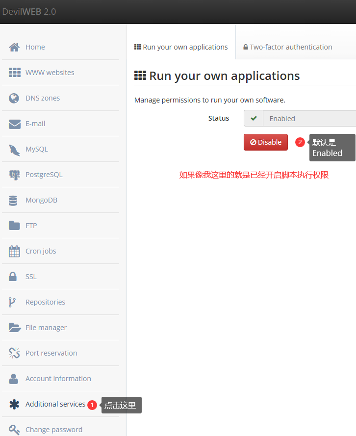
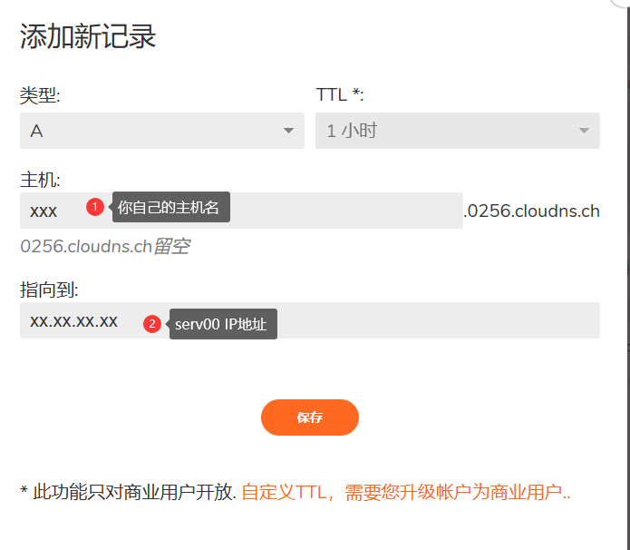
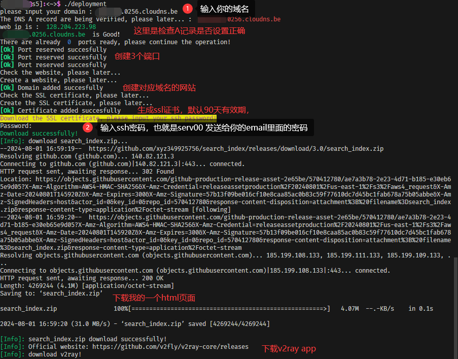
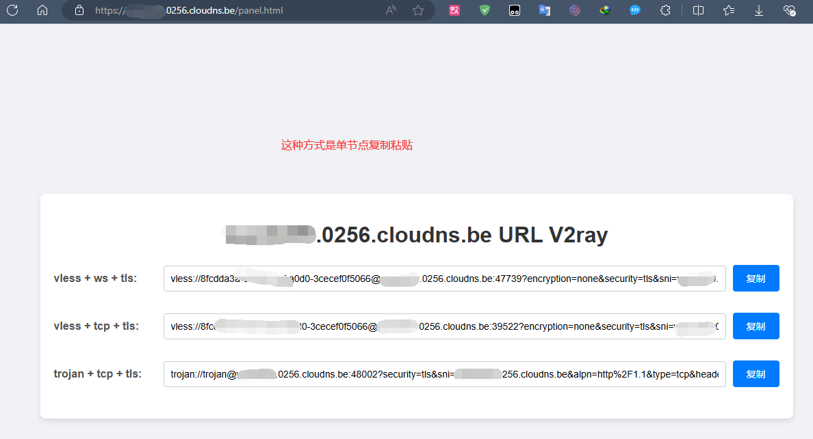
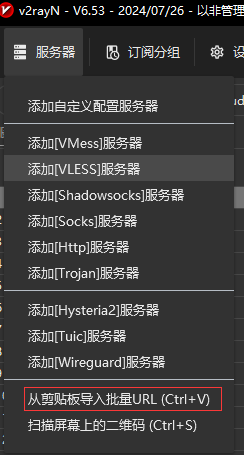
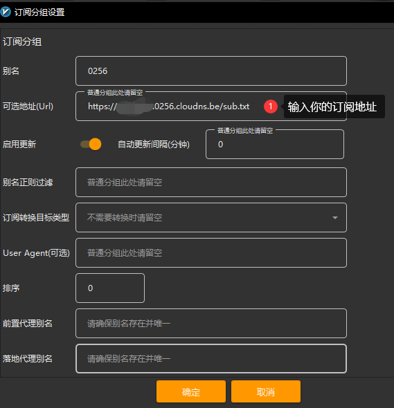
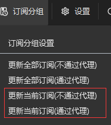
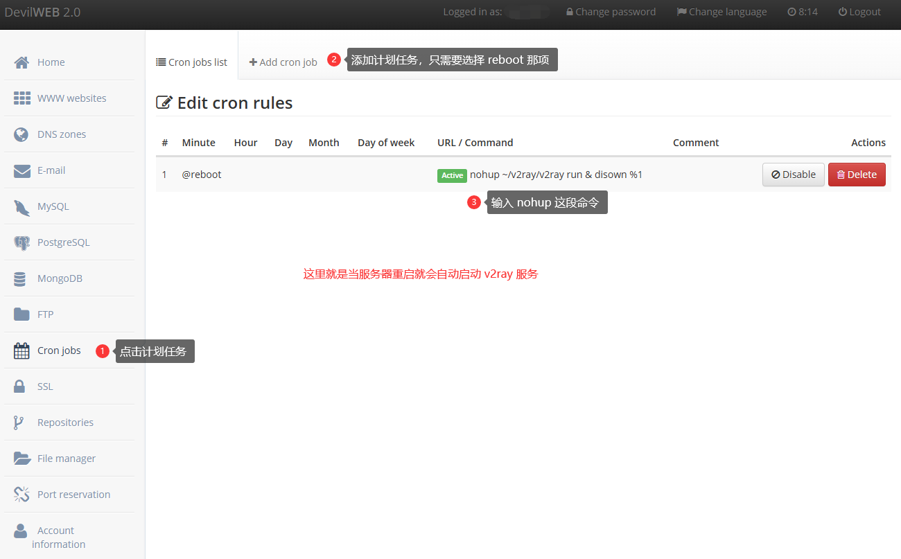

> [!tip]
>
> 使用本脚本部署 vless + tcp +tls , vless + ws + tls , trojan + tcp +tls 。由于中途需要使用到serv00 提供的自动更新证书服务，因此需要输入一次 ssh 密码[可以粘贴]，部署成功后  https://域名/panel.html 是单条 URL ， https://域名/sub.txt 是订阅地址。


# 前置

## 开启脚本执行权限




## DNS准备

https://www.cloudns.net/

申请很简单，不介绍了。

创建域点击这里的添加记录




等待这里是这个状态图标的时候就说明已经生效了。


> [!important]
>
> 如何查看serv00 vps 地址？
>
> 1.进入serv00 发给你的邮件找到  **Domains and subdomains:**   这里有一个自带的域名。
>
> 2.打开 运行输入 cmd (或者使用powershell) 输入 ping 域名 .(https://xxx.serv00.net/.)
>
> 命令输入  ping xxx.serv00.net   返回的信息中找到中括号内的 IP地址 就是你的A记录IP地址。
>
> 3.如果不会，脚本运行输入你的域名，会提示你当前服务器的IP地址。


## 如何使用？

> [!caution]
>
> 1. 脚本中的 initialize_serv00 是初始化脚本会删除已经创建好的 website ,port ,ssl cert。如果不是干净的vps 请不要使用该脚本，否则后果自负。
> 1. 脚本中的 deployment 是部署脚本，需要用户输入 已经添加了A记录的 域名。中途会使用到 serv00 提供的到期自动更证书服务。本脚本中使用的证书是系统提供的【默认90天】，如果到期可以再次执行该脚本。

首先使用 ssh 进入 serv00 vps

> [!note]
>
> 这里如果不能访问 ssh ,有两种情况
>
> 1. 官网不允许您的IP地址，去这 https://www.serv00.com/ip_unban/ 解锁
> 2. sx.serv00.com 被墙了。需要其他方法【或者 使用 proxy】

```shell
# 下载脚本
[xxx@s5]:<~>$ git clone https://github.com/xyz349925756/serv00-v2ray.git
[xxx@s5]:<~>$ cd serv00-v2ray/
[xxx@s5]:<~/serv00-v2ray>$ cp initialize_serv00 ~
[xxx@s5]:<~/serv00-v2ray>$ cp deployment ~
[xxx@s5]:<~/serv00-v2ray>$ cd 
# 添加执行权限
[wan3499@s5]:<~>$ chmod u+x deployment 
[wan3499@s5]:<~>$ chmod u+x initialize_serv00 
```

### 初始化vps

这步操作有其他数据的慎用！！！


> [!caution]
>
> 三个端口是服务器的上限！如果有其他占用端口的情况可能会出现异常情况。

### 部署

这里的前提条件就是 域名的A记录一定要设置正确，脚本会使用 `nslookup 域名` 来检测是否设置正确，因为后面的ssl证书也会使用到A记录。

> [!warning]
>
> 如果第二次部署需要删除进程，具体操作可以参考下面的

```shell
[xxx@s5]:<~>$ sockstat -l
USER     COMMAND    PID   FD  PROTO  LOCAL ADDRESS         FOREIGN ADDRESS      
xxx  v2ray      74853 7   tcp46  *:36305               *:*
xxx  v2ray      74853 8   tcp46  *:43934               *:*
xxx  v2ray      74853 9   tcp46  *:50403               *:*
[xxx@s5]:<~>$ kill 74853
[xxx@s5]:<~>$ sockstat -l
USER     COMMAND    PID   FD  PROTO  LOCAL ADDRESS         FOREIGN ADDRESS      
```




```shell
[xxx@s5]:<~>$ ./deployment 
```

只需要根据上图步骤就可以完成部署。

#### 客户端 URL 获取

##### 复制URL

https://xxx/panel.html

这里的 xxx 就是上面你的域名。



现在我们打开 v2rayN 



测试下


激活这个连接


免费的vps 速度肯定有一些限制。比一般小机场好很多了。

##### 使用订阅连接

https://xxx/sub.txt

这里的 xxx 是你的域名

 



都可以更新。


速度还可以。

### 计划任务

服务器要添加一条计划任务



到这里基本已经完成了。


## 多台 serv00 VPS怎么操作？

可以使用ssh互信脚本

先登录到 serv00 

每台vps操作

```shell
$ ssh-keygen -t rsa       # 生成各自的key文件
$ ssh-copy-id -i  .ssh/id_rsa.pub xxx@sx.serv00.com
```

设置完成 ctrl+d 退出一个 shell ，不然会出现权限不足。

> [!tip]
>
> 可以使用 scp 命令将 sub.txt 复制到某一台 vps，然后使用 cat xxx/sub.txt >> xx.txt 文件中。
>
> 将所有的 serv00 vps  sub.txt 文件都添加到某一台 server 的 ~/domains/你的域名/public_html/
>
> 文件夹下，这个xx.txt 自己随便命令。使用的时候是 https://xxx/xx.txt 就可以。


后面遇到什么问题再添加吧。

> [!caution]
>
> 本项目只是一个实验性的脚本开发，用于学术交流。
>
> 请使用者遵守相关法律法规。请勿违规操作导致封号，与本项目无关。


